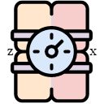
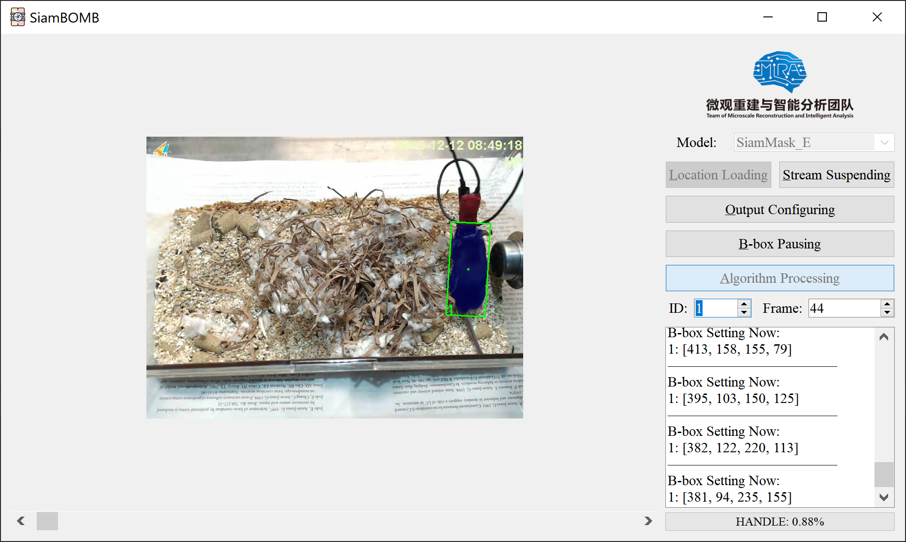

#  SiamBOMB

[](https://github.com/JackieZhai/SiamBOMB/blob/20210919/LICENSE)


[](https://github.com/JackieZhai/SiamBOMB/releases)
[](https://github.com/JackieZhai/SiamBOMB/commits/20210919)

This repo is the second preview version of SiamBOMB, which is updating in September 2021.\
Copyright \(c\) 2021 Institute of Automation, Chinese Academy of Sciences. 
All rights reserved.
<p align="center"></p>

## Introduction
Our Paper (IJCAI 2020 Demo Track): [10.24963/ijcai.2020/776](https://www.ijcai.org/Proceedings/2020/0776.pdf)

<p align="center"></p>

1. TODO

## Setup
### 1. Configure environments
* Linux (Ubuntu 18.04 or higher) or Windows (10).
* C++ build tools (g++ / 2015+ and ninja).
```Shell
# for ubuntu 18+
sudo apt install build-essential ninja-build
```
* CUDA 10.1, 10.2, 11.1, etc. (with cuDNN).
* Anaconda 4+ (or virtualenv etc.) and Python 3.6+.
```Shell
# create anaconda env
conda create -n SiamBOMB python=3.7 -y
conda activate SiamBOMB
```
* PyTorch (see https://pytorch.org/get-started/locally).
### 2. Install dependencies
```Shell
# install the pyqt5
conda install pyqt=5 -y

# install other packages
pip install numpy opencv-python pyyaml yacs tqdm colorama matplotlib cython tensorboardX imutils pandas tb-nightly visdom scikit-image tikzplotlib

# install optional packages
pip install spatial-correlation-sampler jpeg4py
sudo apt-get install libturbojpeg
```
### 3. Equip models
* SiamMask_E pretrained model: [Google Drive](https://drive.google.com/file/d/1VVpCAUJeysyRWdLdfW1IsT3AsQUQvwAU/view), 
[Baidu Pan](https://pan.baidu.com/s/1q64A2jPEWmdj264XrfvhBA) (jffj) \
into `pysot/experiments/siammaske_r50_l3/model.pth`
* KYS pretrained model: [Google Drive](https://drive.google.com/open?id=1nJTBxpuBhN0WGSvG7Zm3yBc9JAC6LnEn), 
[Baidu Pan](https://pan.baidu.com/s/1el4NGj9LYn3lF_FNZv4Xig) (bf3u)\
into `pytracking/networks/kys.pth`
* LWL pretrained model: [Google Drive](https://drive.google.com/file/d/1aAsj_N1LAMpmmcb1iOxo2z66tJM6MEuM/view?usp=sharing), 
[Baidu Pan](https://pan.baidu.com/s/1Xu79riptlOLorp0w3uQ3jw) (w244)\
into `pytracking/networks/lwl_boxinit.pth`
* KeepTrack pretrained model: [Google Drive](https://drive.google.com/file/d/1JIhzF1yd1EFbVCKJMakqEjWngthySIS5), 
[Baidu Pan](https://pan.baidu.com/s/1W5Xxwrxl2Bge9nB1qWY2SQ) (g92v)\
into `pytracking/networks/keep_track.pth`\
and base model: [Google Drive](https://drive.google.com/file/d/1lzwdeX9HBefQwznMaX5AKAGda7tqeQtg), 
[Baidu Pan](https://pan.baidu.com/s/1w1-0kSRq1X2zu-k1mAqsoQ) (zylv)\
into `pytracking/networks/super_dimp_simple.pth`

## Citation
```
@inproceedings{SiamBOMB,
  title     = {SiamBOMB: A Real-time AI-based System for Home-cage Animal Tracking, Segmentation and Behavioral Analysis},
  author    = {Chen, Xi and Zhai, Hao and Liu, Danqian and Li, Weifu and Ding, Chaoyue and Xie, Qiwei and Han, Hua},
  booktitle = {Proceedings of the Twenty-Ninth International Joint Conference on
               Artificial Intelligence, {IJCAI-20}},
  publisher = {International Joint Conferences on Artificial Intelligence Organization},             
  pages     = {5300--5302},
  year      = {2020},
  month     = {7},
  doi       = {10.24963/ijcai.2020/776},
  url       = {https://doi.org/10.24963/ijcai.2020/776},
}
```

## References
```
@article{A_Common_Hub,
  title={A common hub for sleep and motor control in the substantia nigra},
  author={Liu, Danqian and Li, Weifu and Ma, Chenyan and Zheng, Weitong and Yao, Yuanyuan and Tso, Chak Foon and Zhong, Peng and Chen, Xi and Song, Jun Ho and Choi, Woochul and others},
  journal={Science},
  volume={367},
  number={6476},
  pages={440--445},
  year={2020},
  publisher={American Association for the Advancement of Science}
}
```
