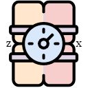
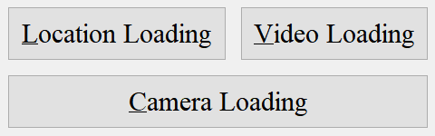
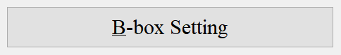
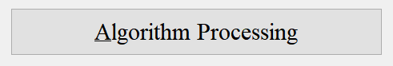
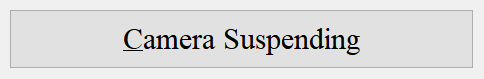
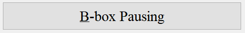
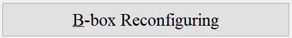
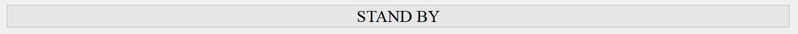
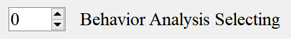
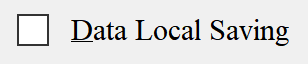

#  SiamBOMB

[](https://github.com/JackieZhai/SiamBOMB/blob/master/LICENSE)


[](https://github.com/JackieZhai/SiamBOMB/releases)


This repo is preview version 1.0 of SiamBOMB, previous version in commit before March 2021.\
Copyright \(c\) 2021 Institute of Automation, Chinese Academy of Sciences. 
All rights reserved.
<p align="center"></p>

## Introduction
News: Multi-animal Tracking Features is Comming!\
Our Demo Video: [https://youtu.be/lLIPdOsnzT8](https://youtu.be/lLIPdOsnzT8) or [https://www.bilibili.com/video/av92152869](https://www.bilibili.com/video/av92152869) \
Our Paper (IJCAI 2020 Demo Track): [10.24963/ijcai.2020/776](https://www.ijcai.org/Proceedings/2020/0776.pdf) \
Demo from [Ziegler et al.](https://zenodo.org/record/3608658), [Jhuang et al.](https://www.nature.com/articles/ncomms1064) (see [releases](https://github.com/JackieZhai/SiamBOMB/releases))

<p align="center"></p>
<p align="center"></p>

1. This project is based on [PySOT](https://github.com/STVIR/pysot).
2. We develop it with [PyQt5](https://www.riverbankcomputing.com/software/pyqt/intro).
3. It can import images, video and webcam.
4. It can setting multiple tracking objects.
5. It can revert to the previous frame for correction.
6. It can do fundamental behavioral analysis and save data.
## Setup
### 1. Configure environments
* Linux (Ubuntu 18.04) or Windows (10).
* GPU (at least have 4 GB memory).
* CUDA 10.1 (with cuDNN).
* Anaconda 4.8+ (or virtualenv etc.) and Python 3.6+.
* C++ build tools (g++ in Linux or 2015+ in Windows).
* Download .zip or `git clone` our code.
### 2. Install dependencies
```Shell
# create anaconda env
conda create -n SiamBOMB python=3.6
conda activate SiamBOMB

# install the pytorch
conda install pytorch torchvision cudatoolkit=10.1 -c pytorch

# install the pyqt5
pip install pyqt5-tools

# install other packages
pip install numpy opencv-python pyyaml yacs tqdm colorama matplotlib cython tensorboardX imutils

# build extensions
python setup.py build_ext --inplace
```
### 3. Equip models
A simple SiamMask pretrained model: \
[Google Drive](https://drive.google.com/file/d/1VVpCAUJeysyRWdLdfW1IsT3AsQUQvwAU/view), [Baidu Pan](https://pan.baidu.com/s/1q64A2jPEWmdj264XrfvhBA) (key: jffj) \
You need to copy it into `pysot/experiments/siammaske_r50_l3/`.\
You can also choose other models from: [Model Zoo](https://github.com/STVIR/pysot/blob/master/MODEL_ZOO.md) (need to modify codes).
## Demo
```Shell
python window_running.py
```
1. [Top three buttons] Choose one of three loading ways: images, video or webcam.

<p align="center"></p>

2. [B-box setting] Select several bounding for your targets and determine which is the first frame, it can re-select (Using the Keyboard ',' and '.' or bottom-right ScrollBar).

<p align="center"> </p>

3. [Algorithm processing] Do tracking and segmentation, press [...Suspending] if you want to terminate.

<p align="center">
</p>

4. [Revert for correcting] If there are any errors during the operation, you can [...Pause] and revert to a previous frame (Using the Keyboard ',' and '.' or bottom-right ScrollBar) in order to correct them (Using the Mouse Right Click or [...Reconfiguring]). Note: not available for Camera Loading.

<p align="center">
</p>

* Bottom-left is Status/ProcessBar.

<p align="center"></p>

* Top-left shows output messages including Behavior Analysis. Middle-Right SpinBox for selecting from multiple target, note that the number in the box is the object number.

<p align="center"></p>

* Middle-Right CheckBox for saving data locally. You can use bottom-right ScrollBar for review after Algorithm procedure.

<p align="center"></p>

* Suitable for any size of image stream which is smaller than projection area (you can rescale the window before loading stream). The results are saved in the path of `ans` as following:
  > images: named as frame number in `ans/stream_name/tracker_name`

  > video: saved in `ans/stream_name/tracker_name/video.avi` generated after the last frame has been processed.

  > bboxes: saved in `ans/stream_name/tracker_name/bbox.npy` and `.txt`, types `numpy.load('bbox.npy')` to load it

  > masks: named as frame number in `ans/stream_name/tracker_name/mask`, the pixel-wise values are `255 - object_number`

  > analysis data: saved in `ans/stream_name/tracker_name/analysis.pkl`, types `pickle.load(open('analysis.pkl', 'rb'))` to load it


## Citation
```
@inproceedings{SiamBOMB,
  title     = {SiamBOMB: A Real-time AI-based System for Home-cage Animal Tracking, Segmentation and Behavioral Analysis},
  author    = {Chen, Xi and Zhai, Hao and Liu, Danqian and Li, Weifu and Ding, Chaoyue and Xie, Qiwei and Han, Hua},
  booktitle = {Proceedings of the Twenty-Ninth International Joint Conference on
               Artificial Intelligence, {IJCAI-20}},
  publisher = {International Joint Conferences on Artificial Intelligence Organization},             
  pages     = {5300--5302},
  year      = {2020},
  month     = {7},
  doi       = {10.24963/ijcai.2020/776},
  url       = {https://doi.org/10.24963/ijcai.2020/776},
}
```

## References
### Repositories
[PySOT](https://github.com/STVIR/pysot), 
[SiamFC](https://github.com/huanglianghua/siamfc-pytorch), 
[SiamRPN](https://github.com/foolwood/DaSiamRPN), 
[SiamMask](https://github.com/foolwood/SiamMask), 
[THOR](https://github.com/xl-sr/THOR), 
[SiamMask_E](https://github.com/baoxinchen/siammask_e)
### Papers
```
@article{A_Common_Hub,
  title={A common hub for sleep and motor control in the substantia nigra},
  author={Liu, Danqian and Li, Weifu and Ma, Chenyan and Zheng, Weitong and Yao, Yuanyuan and Tso, Chak Foon and Zhong, Peng and Chen, Xi and Song, Jun Ho and Choi, Woochul and others},
  journal={Science},
  volume={367},
  number={6476},
  pages={440--445},
  year={2020},
  publisher={American Association for the Advancement of Science}
}

@inproceedings{SiamMask,
  title={Fast online object tracking and segmentation: A unifying approach},
  author={Wang, Qiang and Zhang, Li and Bertinetto, Luca and Hu, Weiming and Torr, Philip HS},
  booktitle={Proceedings of the IEEE conference on computer vision and pattern recognition},
  pages={1328--1338},
  year={2019}
}

@article{SiamMask_E,
  title={Fast visual object tracking with rotated bounding boxes},
  author={Chen, Bao Xin and Tsotsos, John K},
  journal={arXiv preprint arXiv:1907.03892},
  year={2019}
}

@article{THOR,
  title={Tracking Holistic Object Representations},
  author={Sauer, Axel and Aljalbout, Elie and Haddadin, Sami},
  journal={arXiv preprint arXiv:1907.12920},
  year={2019}
}

@article{MeMu,
  title={MeMu: Metric correlation Siamese network and multi-class negative sampling for visual tracking},
  author={Xiao, Yafu and Li, Jing and Du, Bo and Wu, Jia and Chang, Jun and Zhang, Wenfan},
  journal={Pattern Recognition},
  volume={100},
  pages={107170},
  year={2020},
  publisher={Elsevier}
}

@inproceedings{UpdateNet,
  title={Learning the model update for siamese trackers},
  author={Zhang, Lichao and Gonzalez-Garcia, Abel and Weijer, Joost van de and Danelljan, Martin and Khan, Fahad Shahbaz},
  booktitle={Proceedings of the IEEE/CVF International Conference on Computer Vision},
  pages={4010--4019},
  year={2019}
}
```
